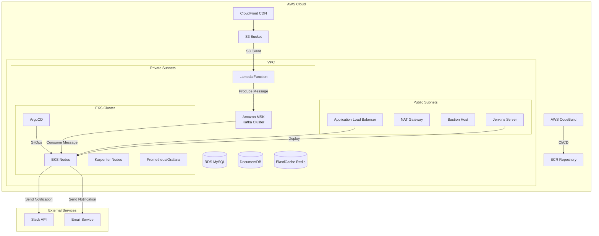

# 🚀 Fanda Cloud Infrastructure Project

> **Enterprise-grade AWS Cloud Infrastructure with Event-Driven Architecture**

[](https://terraform.io)
[](https://aws.amazon.com)
[](https://kubernetes.io)
[](https://python.org)

## 📋 프로젝트 개요

Fanda는 **완전 관리형 AWS 클라우드 인프라**를 기반으로 한 **이벤트 드리븐 아키텍처** 프로젝트입니다. S3 파일 업로드 이벤트를 트리거로 하여 MSK(Kafka)를 통해 실시간 알림을 Slack과 Email로 전송하는 시스템을 구현했습니다.

### 🎯 핵심 특징
- **Infrastructure as Code**: Terraform을 활용한 완전 자동화된 인프라 구성
- **Event-Driven Architecture**: S3 → Lambda → MSK → Consumer 파이프라인
- **Container Orchestration**: EKS + Karpenter를 통한 자동 스케일링
- **CI/CD Pipeline**: AWS CodeBuild를 활용한 자동 배포
- **Multi-Channel Notification**: Slack, Email 동시 알림 지원
- **Monitoring & Observability**: Prometheus + Grafana 모니터링 스택

## 🏗️ 아키텍처 다이어그램



## 🛠️ 기술 스택

### Infrastructure & DevOps
- **IaC**: Terraform 1.6.6
- **Container Orchestration**: Amazon EKS, Karpenter
- **Service Mesh**: AWS Load Balancer Controller
- **CI/CD**: AWS CodeBuild, ArgoCD
- **Monitoring**: Prometheus, Grafana
- **Version Control**: Git, GitHub

### Backend & Data
- **Message Streaming**: Amazon MSK (Kafka)
- **Serverless**: AWS Lambda
- **Databases**: RDS MySQL, DocumentDB, ElastiCache Redis
- **Storage**: Amazon S3, ECR
- **CDN**: CloudFront

### Application
- **Runtime**: Python 3.13
- **Message Processing**: Kafka-Python, MSK IAM Auth
- **Notification**: Slack API, Email
- **Container**: Docker

## 📁 프로젝트 구조

```
terraform/
├── main.tf                    # 메인 Terraform 구성
├── variables.tf               # 변수 정의
├── outputs.tf                 # 출력 값
├── provider.tf                # AWS Provider 설정
├── deploy.sh                  # 자동 배포 스크립트
├── destroy.sh                 # 인프라 정리 스크립트
├── buildspec-terraform.yml    # CodeBuild 빌드 스펙
│
├── modules/                   # Terraform 모듈
│   ├── vpc/                   # VPC 및 네트워킹
│   ├── eks/                   # EKS 클러스터
│   ├── karpenter/             # Karpenter 오토스케일러
│   ├── msk/                   # MSK Kafka 클러스터
│   ├── lambda/                # Lambda 함수
│   ├── db/                    # RDS, DocumentDB
│   ├── elasticcache/          # Redis 클러스터
│   ├── alb/                   # Application Load Balancer
│   ├── monitoring/            # Prometheus, Grafana
│   ├── argocd/                # ArgoCD GitOps
│   ├── jenkins/               # Jenkins CI/CD
│   ├── ecr/                   # Container Registry
│   └── cloudfront/            # CDN 설정
│
└── consumer/                  # Kafka Consumer 애플리케이션
    ├── consumer.py            # 메인 컨슈머 로직
    ├── dockerfile             # 컨테이너 이미지
    ├── deployment.yaml        # Kubernetes 배포 매니페스트
    ├── requirements.txt       # Python 의존성
    └── channels/              # 알림 채널 핸들러
        ├── slack_handler.py   # Slack 알림
        └── email_handler.py   # Email 알림
```

## 🚀 주요 구현 내용

### 1. Event-Driven Message Processing Pipeline

**S3 → Lambda → MSK → Consumer** 파이프라인을 구현하여 파일 업로드 시 실시간 알림을 처리합니다.

```python
# Lambda Producer (S3 이벤트 처리)
def lambda_handler(event, context):
    kafka_producer = get_kafka_producer()
    
    for record in event.get('Records', []):
        s3_info = record.get('s3', {})
        message = {
            'fileName': os.path.basename(s3_info.get('object', {}).get('key')),
            'bucketName': s3_info.get('bucket', {}).get('name'),
            'uploadTime': record.get('eventTime'),
            's3Url': f"s3://{bucket}/{key}",
            'category': determine_category(key)
        }
        
        kafka_producer.send(TOPIC, message)
```

### 2. MSK IAM Authentication

AWS MSK에서 IAM 기반 인증을 구현하여 보안성을 강화했습니다.

```python
class MSKTokenProvider(AbstractTokenProvider):
    def token(self) -> str:
        token, _ = MSKAuthTokenProvider.generate_auth_token(self.region)
        return token
```

### 3. Multi-Channel Notification System

Slack과 Email을 동시에 지원하는 알림 시스템을 구현했습니다.

```python
class KafkaToChannelsService:
    def __init__(self):
        self.handlers = {}
        enabled_channels = os.getenv('ENABLED_CHANNELS', 'slack,email').split(',')
        if 'slack' in enabled_channels:
            self.handlers['slack'] = SlackHandler()
        if 'email' in enabled_channels:
            self.handlers['email'] = EmailHandler()
```

### 4. Infrastructure as Code

Terraform을 활용하여 전체 인프라를 코드로 관리합니다.

```hcl
# EKS 클러스터 생성
module "eks" {
  source             = "./modules/eks"
  vpc_id             = module.vpc.vpc_id
  public_subnet_ids  = module.vpc.public_subnet_ids
  private_subnet_ids = module.vpc.private_subnet_ids
}

# MSK 클러스터 생성
module "msk" {
  source = "./modules/msk"
  vpc_id = module.vpc.vpc_id
  private_subnet_ids = [
    module.vpc.private_subnet_ids[0],
    module.vpc.private_subnet_ids[1]
  ]
  oidc_provider_arn = module.eks.oidc_provider_arn
}
```

### 5. Automated Deployment Pipeline

단계별 배포 스크립트로 안전한 인프라 구성을 보장합니다.

```bash
# 1단계: 기본 인프라 생성
terraform apply -target=module.vpc -auto-approve
terraform apply -target=module.eks -auto-approve

# 2단계: 클러스터 정보 추출 및 kubeconfig 설정
aws eks update-kubeconfig --region $AWS_REGION --name "$EKS_CLUSTER_NAME"

# 3단계: 전체 리소스 배포
terraform apply -auto-approve
```

## 🔧 배포 및 실행

### 사전 요구사항
- AWS CLI 구성 완료
- Terraform 1.6.6 이상
- kubectl 설치
- Docker 설치

### 배포 단계

1. **저장소 클론**
```bash
git clone https://github.com/simu88/fanda-read.git
cd fanda-read/terraform
```

2. **환경 변수 설정**
```bash
export AWS_REGION="us-east-1"
export TF_VAR_db_password="your-secure-password"
```

3. **Terraform 초기화**
```bash
terraform init
```

4. **자동 배포 실행**
```bash
chmod +x deploy.sh
./deploy.sh
```

5. **배포 확인**
```bash
kubectl get nodes
kubectl get pods -A
```

## 📊 모니터링 및 관찰성

### Prometheus + Grafana 스택
- **메트릭 수집**: Prometheus를 통한 클러스터 및 애플리케이션 메트릭
- **시각화**: Grafana 대시보드를 통한 실시간 모니터링
- **알림**: AlertManager를 통한 장애 알림

### 로그 관리
- **중앙화된 로깅**: CloudWatch Logs 통합
- **구조화된 로그**: JSON 형태의 로그 출력
- **실시간 모니터링**: Lambda 및 Consumer 애플리케이션 로그 추적

## 🔒 보안 고려사항

### Network Security
- **Private Subnets**: 데이터베이스 및 애플리케이션을 프라이빗 서브넷에 배치
- **Security Groups**: 최소 권한 원칙에 따른 보안 그룹 구성
- **NAT Gateway**: 아웃바운드 트래픽을 위한 NAT 게이트웨이

### IAM & Authentication
- **IRSA**: EKS 서비스 계정과 IAM 역할 연결
- **MSK IAM Auth**: Kafka 클러스터에 대한 IAM 기반 인증
- **최소 권한**: 각 서비스별 필요한 최소 권한만 부여

## 📈 성능 최적화

### Auto Scaling
- **Karpenter**: 워크로드 기반 자동 노드 스케일링
- **HPA**: Horizontal Pod Autoscaler를 통한 파드 스케일링
- **MSK Auto Scaling**: Kafka 파티션 자동 확장

### Cost Optimization
- **Spot Instances**: Karpenter를 통한 Spot 인스턴스 활용
- **Resource Limits**: 컨테이너 리소스 제한 설정
- **Lifecycle Management**: S3 객체 수명주기 정책

## 🧪 테스트 및 검증

### 기능 테스트
```bash
# S3 파일 업로드 테스트
aws s3 cp test-file.txt s3://your-bucket/reports/positive/

# Kafka 메시지 확인
kubectl exec -it kafka-consumer-pod -- kafka-console-consumer.sh \
  --bootstrap-server localhost:9092 --topic fanda-notifications
```

### 모니터링 확인
- Grafana 대시보드: `http://grafana-url/dashboards`
- Prometheus 메트릭: `http://prometheus-url/metrics`
- ArgoCD UI: `http://argocd-url`

## 🤝 기여 방법

1. Fork the repository
2. Create your feature branch (`git checkout -b feature/AmazingFeature`)
3. Commit your changes (`git commit -m 'Add some AmazingFeature'`)
4. Push to the branch (`git push origin feature/AmazingFeature`)
5. Open a Pull Request

## 📝 라이선스

이 프로젝트는 MIT 라이선스 하에 배포됩니다. 자세한 내용은 [LICENSE](LICENSE) 파일을 참조하세요.

## 📞 연락처

- **GitHub**: [@simu88](https://github.com/simu88)
- **Email**: your-email@example.com
- **LinkedIn**: [Your LinkedIn Profile](https://linkedin.com/in/yourprofile)

---

⭐ **이 프로젝트가 도움이 되었다면 Star를 눌러주세요!**
